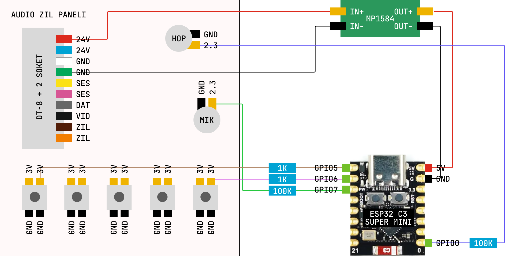

# audio-diafon-hack

Bu repository [ESP32 ile Zil Panelini Hackledim](https://www.youtube.com/watch?v=hRlOE7X7TNE) videosunda yaptığım projenin benzerini yapmak isteyenler için bir rehber niteliğindedir.

Videoda Audio marka mekanik tuşlu, DT-8 + 2 pinli konektörle çalışan daire içi zil panelini, basit tersine mühendislik yöntemleri kullanarak internetten kontrol edilebilir hale getiriyorum.

Projeye ilginiz için teşekkürler, o kadar çok kişi devre şeması istedi ki, bu dokümanı bir avm yemek masasında otururken yazmak zorunda kaldım :)

### Hangi Zil Paneli
Tam emin olmamakla birlikte, videoda hack'lediğim zil paneli modelinin [4.3'' Görüntülü Diafon Bus Plus (Mekanik Butonlu)](https://www.audio.com.tr/urunler/goruntulu-diafon/yeni-bus-plus/4-3-goruntulu-diafon-bus-plus-mekanik-butonlu/) olduğunu düşünüyorum.

Size tavsiyem bu rehberi takip ederken, sizdeki modelin veya serinin farklı olabileceğini aklınızda tutmanız ve voltaj ölçüp pinlerin sağlamasını yapmadan gözü kapalı bu rehberi takip etmemeniz yönündedir.

### Bağlantı Şeması

### ESPHOME Entegrasyonu
Cihaza ilk flash'lama yapıldıktan sonra [smart-door.yaml](smart-door.yaml) dosyasındakine benzer bir kod atılarak, cihaz kontrol edilebilir.

### Butona Uzaktan Basma
Zil panelindeki buton pinlerinin pozitif uçları 1K dirençle GPIO pinlere bağlanır. GPIO pini LOW'a çekildiğinde butona basılmış gibi olur.

YAML kodunda `inverted: true` kullanılarak, Home Assistant üzerinden bu switch aktifleşince, HIGH yerine LOW verilir.

Not: AUDIO zil panelinde kapı tuşunun çalışması için önce bir kez diafon tuşuna basılmalı, görüntünün ekrana gelmesi beklenmeli, sonra kapı tuşuna basılmalıdır. Basma-çekme süresi olarak 200-300 ms gibi fiziksel basma süresi taklit edilebilir.

### Zil Algılama
Ben aşağı zil çaldığında bunu anlamak istiyordum o yüzden hoparlörün artı ucunda oluşan voltajı analog input pinine 100K paralel bağlayarak dinledim. 0.5 voltun üzerinde voltaj gördüğümde bunu yüksek şiddette ses (yani zil) olarak algılıyorum. Ama diafonla konuşma sırasında yüksek sesle konuşulduğunda da burası tetikleniyor.

### Aşağı Ses Gönderme
Mikrofon pininin artı ucuna 100K dirençle bağlı PWM pini üzerinden kare dalga parazit vererek mikrofonun algıladığı iç mekan sesine ses enjekte ediyorum. RTTTL kütüphanesi sayesinde eski tuşlu telefonlardaki zil sesi yapma notasyonu kullanarak istenilen melodi çaldırılabiliyor.

Not: Bu sesi parazit olarak verdiğimde malesef iç panelden de bu ses duyuluyor ve şu anki halinde biraz yüksek. Koddaki duty-cycle düşürülerek test edilebilir.

Not 2: Audio panelin mikrofon sesini aşağı iletmesi için diafon tuşunun basılı tutulması lazım. O yüzden diafon butonunu raw output olarak ayarladım, LOW'a çekip bekletiyorum, melodi bittiğinde tekrar HIGH'a çekiyorum. Yani fiziksel olarak diafon tuşuna basılı tutup mikrofona konuşmuş gibi yapıyorum.

### Bilinen Eksikler
- İç zil pinlerinden GND olmayandaki voltaj ölçülüp, 1K dirençle input olarak okunup, iç zile basma event'i esphome üzerinden ayrıca takip edilebilir.

- Video ve sesi internete aktarmak için ESP32'nin yetersiz kalacağını düşünüyorum. Kötü bir bitrate ile de olsa, özellikle videoyu stream edebilen olursa haber versin lütfen :)

### Lisans

Kod MIT lisansı ile lisanslıdır. Lisansa uyarak kodu kullanabilirsiniz.

### Katkı

Proje katkıda bulunulmasına açıktır, ama yoğunluğumdan dolayı pull request'lere hemen bakamayabilirim.

