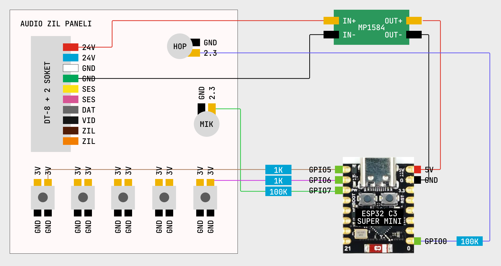

# audio-diafon-hack

Bu repository [ESP32 ile Zil Panelini Hackledim](https://www.youtube.com/watch?v=hRlOE7X7TNE) videosunda yaptığım projenin benzerini yapmak isteyenler için bir rehber niteliğindedir.

Videoda Audio marka mekanik tuşlu, DT-8 + 2 pinli konektörle çalışan daire içi zil panelini, basit tersine mühendislik yöntemleri kullanarak internetten kontrol edilebilir hale getiriyorum.

### Hangi Zil Paneli
Tam emin olmamakla birlikte, videoda hack'lediğim zil paneli modelinin [4.3'' Görüntülü Diafon Bus Plus (Mekanik Butonlu)](https://www.audio.com.tr/urunler/goruntulu-diafon/yeni-bus-plus/4-3-goruntulu-diafon-bus-plus-mekanik-butonlu/) olduğunu düşünüyorum.

Size tavsiyem bu rehberi takip ederken, sizdeki modelin veya serinin farklı olabileceğini aklınızda tutmanız ve voltaj ölçüp pinlerin sağlamasını yapmadan gözü kapalı bu rehberi takip etmemeniz yönündedir.

### Bağlantı Şeması

